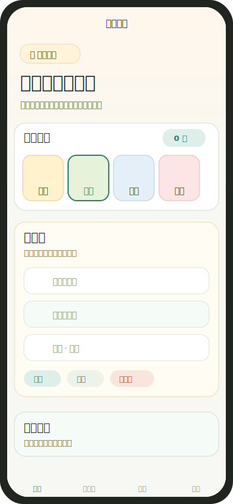
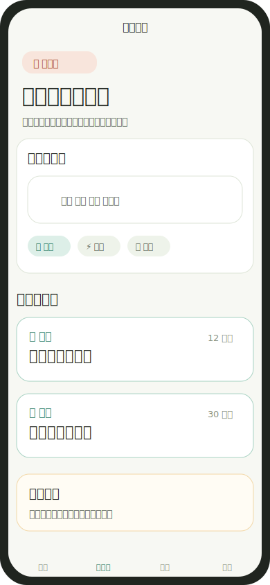
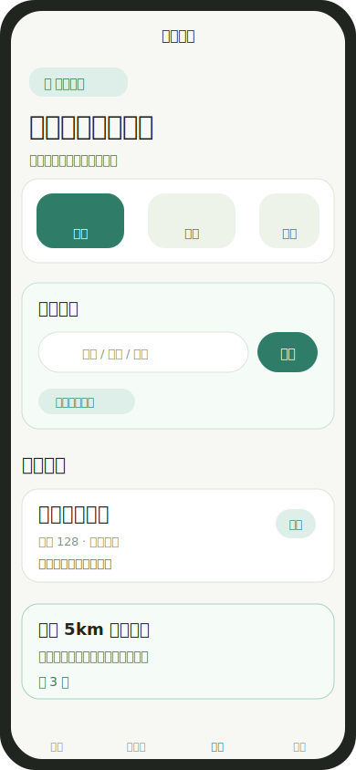
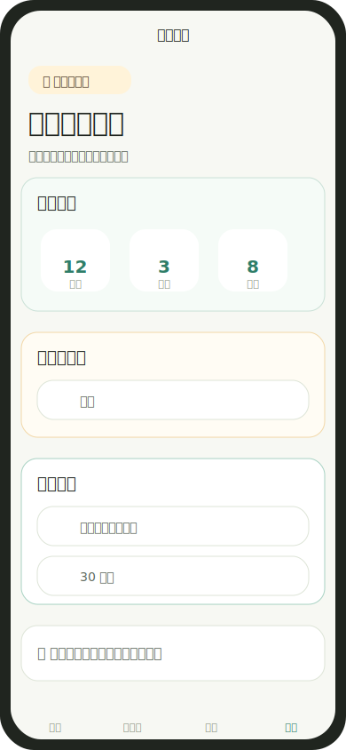

# XiaoCharFood 小馋饭记

XiaoCharFood 是一个面向情侣、小家庭和饭搭子的微信小程序，用低压力方式记录吃过什么、提前规划吃什么、保存去过哪些好店。

它不是严肃的健康管理工具，也不是公开点评社区，而是一个私人饮食生活助手：帮用户少一点纠结，多一点可回顾的日常。

## 软件价值

每天吃饭看似小事，但会反复消耗注意力：

- 今天吃了什么，过几天就记不清。
- 做饭前不知道买什么、做什么。
- 去过的饭店不少，但想复盘时翻不到记录。
- 情侣或小家庭常有共同吃饭场景，但缺少轻量的私人饭本。

小馋饭记把这三件事合在一起：

- `饭卡`：把每一餐轻轻打个卡，形成低压力饮食回顾。
- `菜灵感`：把“今天吃什么”变成可执行的一日菜单和备菜清单。
- `店记`：把吃过的饭店、菜品、人均、地址和评价沉淀下来。
- `小窝`：保存昵称、偏好和本地数据状态，让体验更私人。

## 界面截图

> 当前截图为仓库内维护的 SVG 界面预览图，用于 README 展示当前产品形态。

| 饭卡 | 菜灵感 |
|---|---|
|  |  |

| 店记 | 小窝 |
|---|---|
|  |  |

## 功能说明

### 饭卡

用于记录每一天吃了什么。

- 支持早餐、午餐、晚餐、加餐四类图像化打卡。
- 支持记录“吃了什么”“和谁一起吃”“一句话感受”。
- 同行人第一次手动输入后，会从历史记录中自动沉淀为常用快捷项。
- 支持外食、清淡、偏油、蔬菜少、吃撑了、满意、放纵餐等常用描述。
- 常用描述点击后会追加到一句话感受，减少重复输入。
- 已保存记录支持编辑和删除。
- 记录包含日期和具体时间。
- 提供最近 7 天低压力回顾，不打分、不制造焦虑。

### 菜灵感

用于减少“今天做什么”的思考成本。

- 支持口味、食材、减肥、增肌、高蛋白、少油、川菜、家常等关键词。
- 内置 40 道常见中餐和轻食菜谱库，当前不依赖 AI。
- 一次性推荐早餐、午餐、晚餐、加餐。
- 自动汇总备菜/买菜清单。
- 可保存整套一日菜单。
- 可将某一餐推荐直接记入饭卡。

### 店记

用于保存私人饭店记忆。

- 支持新增饭店记忆，保存店名、人均、菜品、备注和场景标签。
- 支持从微信地图选择餐厅地址，并保存经纬度。
- 支持按店名、菜品、备注搜索。
- 输入搜索时展示下拉联想；搜索无结果时可直接新增店记。
- 支持筛选“还想再去”的饭店。
- 支持获取当前位置，显示附近 5km 内保存过地址的饭店。
- 支持通过地图标注和 `wx.openLocation` 打开饭店位置。

### 小窝

用于维护本地偏好和隐私边界。

- 设置和修改用户称呼。
- 设置做饭口味偏好和常见做饭时长。
- 查看本地饮食记录、菜单计划、饭店记忆数量。
- 支持清空本地数据。

## 体验设计

当前视觉方向是“年轻情侣/小家庭的饭桌生活感”：

- 图优先、字辅助：关键入口尽量使用食物、地图、清单等主题图像帮助识别。
- 少说教：健康相关表达使用“回顾、平衡、建议”，避免惩罚式反馈。
- 低压力：记录可以不完整，先随手保存，再逐步补充。
- 私人感：强调饭搭子、同行人、店记、小窝等生活化语义。
- 温暖轻量：浅暖背景、软卡片、冰箱贴式 sticker、圆润字体和图标输入槽。

## 技术结构

```text
.
├── app.js
├── app.json
├── app.wxss
├── assets/
│   └── tabbar/              # TabBar PNG 图标
├── backend/                 # Python 独立后端，本地开发可和小程序联动
│   ├── src/
│   └── tests/
├── docs/
│   ├── BACKEND_DEPLOYMENT_PLAN.md
│   ├── FRONTEND_BACKEND_SYNC.md
│   └── screenshots/         # README 界面预览图
├── pages/
│   ├── index/               # 饭卡：饮食打卡、记一餐、周回顾
│   ├── cook/                # 菜灵感：一日菜单推荐、买菜清单
│   ├── restaurants/         # 店记：餐厅记忆、地图定位
│   └── mine/                # 小窝：偏好和本地数据
└── utils/
    ├── store.js             # 本地存储数据层
    ├── recommender.js       # 本地规则推荐和固定菜谱库
    └── util.js
```

## 后端部署方案

项目已新增 Python 独立后端，并且小程序具备本地开发联动能力。当前采用本地优先策略：用户操作先写入本地缓存，后端可用时自动同步完整快照。

- [docs/BACKEND_DEPLOYMENT_PLAN.md](docs/BACKEND_DEPLOYMENT_PLAN.md)
- [docs/FRONTEND_BACKEND_SYNC.md](docs/FRONTEND_BACKEND_SYNC.md)
- [docs/DEPLOYMENT_CHECKLIST.md](docs/DEPLOYMENT_CHECKLIST.md)
- [backend/README.md](backend/README.md)

## 本地运行

1. 使用微信开发者工具打开本项目目录。
2. 导入 `project.config.json`。
3. 在模拟器中编译运行。

当前小程序根目录没有配置 `package.json` 或 `miniprogram-ci`，因此暂不支持命令行构建。

## 验证方式

基础语法检查：

```powershell
node --check app.js
node --check utils/store.js
node --check utils/backendConfig.js
node --check utils/apiClient.js
node --check utils/syncManager.js
node --check utils/recommender.js
node --check pages/index/index.js
node --check pages/cook/cook.js
node --check pages/restaurants/restaurants.js
node --check pages/mine/mine.js
```

后端基础测试：

```powershell
cd backend
python -m unittest discover -s tests
```

前后端同步合并测试：

```powershell
node tests/syncManager.test.js
```

已使用 mock `wx` 做过以下 smoke test：

- 饭卡记录新增、编辑、删除。
- 同行人保存、历史常用项提取和点击追加。
- 常用描述点击追加到一句话感受。
- 菜灵感一日菜单生成和备菜清单生成。
- 店记按菜品/备注搜索。

## 已知限制

- 数据仅保存在本机，没有云同步。
- 暂不支持情侣/家庭共享编辑。
- 暂不支持图片上传存储。
- 地图能力依赖微信小程序位置授权；未保存地址的饭店不会出现在附近地图中。
- 一日菜单推荐是固定菜谱库 + 本地规则推荐，不是 AI 或专业营养建议。
- `减肥`、`增肌` 等关键词仅作为生活化饮食偏好使用，不提供医疗或专业营养诊断。
- README 截图为静态预览图，不是微信开发者工具自动导出的真机截图。

## 后续方向

- 接入云开发或后端，支持多设备同步。
- 增加情侣/家庭共享空间。
- 饭卡记录支持照片。
- 店记支持照片、更多地图能力和消费趋势。
- 菜灵感支持菜谱步骤、菜品替换和后续 AI 推荐。
- 增加更完整的视觉资产和动效细节。
