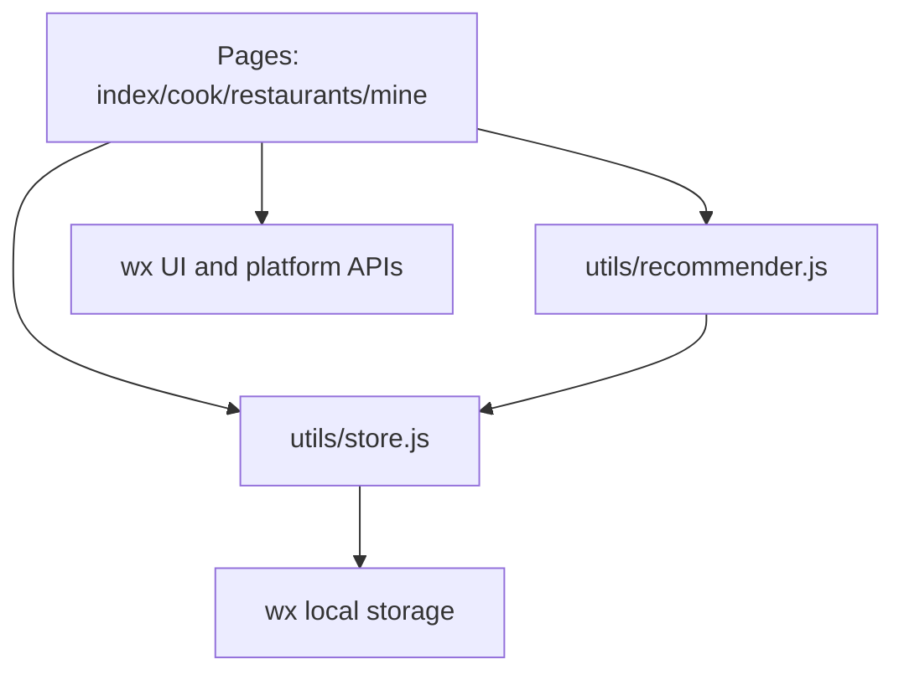
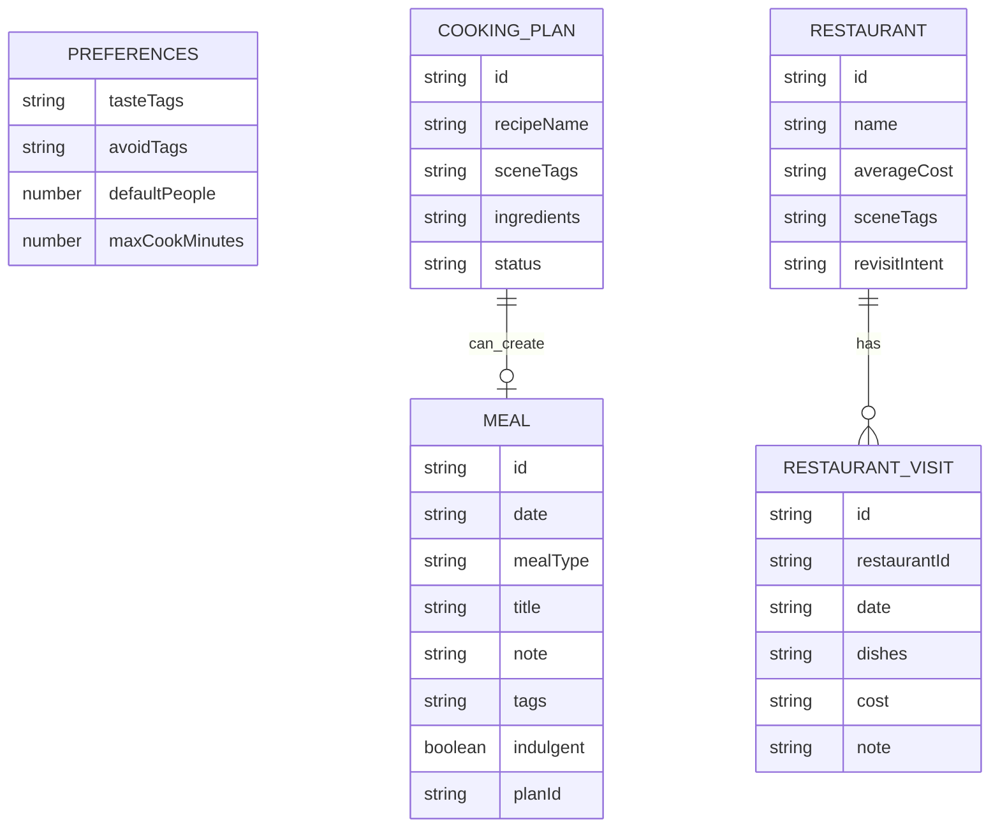

# Architecture Spine - XiaoCharFood MVP

## Design Paradigm

Local-first layered mini-program:



Pages own presentation and user events. `utils/store.js` owns persistence and data shape. `utils/recommender.js` owns deterministic cooking suggestions. No page reads or writes raw storage directly.

## Invariants & Rules

### AD-1 - Native mini-program pages over custom SPA shell [ADOPTED]

- **Binds:** all pages, navigation, tab structure
- **Prevents:** one team building a custom in-page router while another relies on `app.json` routing
- **Rule:** MVP uses WeChat Mini Program native pages and `app.json` tabBar. Each primary IA surface is a page under `pages/{surface}/{surface}`.

### AD-2 - Store module is the only persistence boundary

- **Binds:** FR-1..FR-18
- **Prevents:** incompatible storage keys, record shapes, and mutation behavior across pages
- **Rule:** Pages must call `utils/store.js` for all reads/writes. `wx.getStorageSync` and `wx.setStorageSync` are allowed only inside `utils/store.js` during MVP.

### AD-3 - Local-first data for v1

- **Binds:** FR-1..FR-18, MVP scope
- **Prevents:** premature cloud schema, login, and multi-user sharing work from blocking the first usable version
- **Rule:** v1 stores meals, preferences, cooking plans, and restaurants locally on the device. Cloud sync, household sharing, and cross-device continuity are deferred.

### AD-4 - Stable entity envelopes

- **Binds:** meal records, cooking plans, restaurants, restaurant visits
- **Prevents:** feature pages inventing different IDs, date formats, or ownership conventions
- **Rule:** Every stored entity has `id`, `createdAt`, and `updatedAt` ISO-like local timestamp strings. Child entities reference parents by ID rather than duplicating parent objects.

### AD-5 - Recommendation is deterministic rules first

- **Binds:** FR-8..FR-12
- **Prevents:** architecture depending on an unchosen AI or third-party recipe provider before MVP validates the loop
- **Rule:** v1 cooking suggestions come from a local seed recipe list plus rule filters for scene tags, recent meal names, preference tags, and time. AI generation and imported recipe libraries are deferred behind `utils/recommender.js`.

### AD-6 - Health language is presentation and logic constraint

- **Binds:** FR-3, FR-5..FR-7, UX Voice and Tone
- **Prevents:** one page presenting judgmental health diagnostics while another presents low-pressure reflection
- **Rule:** No code path may classify a meal as medically unhealthy, over-limit, failed, or diagnosed. Weekly review outputs only counts and gentle suggestions from recorded tags.

### AD-7 - Restaurant memory remains private and non-social

- **Binds:** FR-13..FR-15, FR-17
- **Prevents:** restaurant pages drifting into public review, ranking, or map discovery behavior
- **Rule:** Restaurant data is a private list with local filtering. There is no public feed, rating aggregation, merchant identity, or nearby discovery in MVP.

## Consistency Conventions

| Concern | Convention |
| --- | --- |
| Page names | `index`, `cook`, `restaurants`, `mine`; future detail pages use singular nouns such as `meal-detail`. |
| Entity IDs | `prefix_timestamp_random`, generated in `store.js`. Prefixes: `meal`, `plan`, `restaurant`, `visit`. |
| Dates | Store `YYYY-MM-DD` for day grouping and local timestamp strings for created/updated fields. |
| Storage keys | One namespace prefix: `xcf:`. Current keys: `xcf:meals`, `xcf:preferences`, `xcf:plans`, `xcf:restaurants`, `xcf:restaurantVisits`. |
| Mutation | Store functions return the full updated collection or entity; pages update view state from return values. |
| Errors | MVP uses graceful fallback and empty states, not blocking exception screens. |
| Copy | UI copy follows `EXPERIENCE.md` low-pressure language rules. |

## Stack

| Name | Version / Project Reality |
| --- | --- |
| WeChat Mini Program | `compileType: miniprogram` from `project.config.json` |
| Base library | `libVersion: trial` from `project.config.json` |
| Component framework | `glass-easel` from `app.json` |
| JavaScript | ES6 enabled in `project.config.json` |
| Persistence | WeChat `wx` local storage APIs, isolated behind `utils/store.js` |
| Styling | WXSS, no npm UI framework in MVP |

## Structural Seed

```text
.
  app.js
  app.json
  app.wxss
  pages/
    index/          # home, quick meal recording, weekly review
    cook/           # cooking suggestions and plan selection
    restaurants/    # private restaurant memory
    mine/           # preferences and local data tools
  utils/
    store.js        # storage keys, entity creation, CRUD, review selectors
    recommender.js  # local seed recipes and deterministic suggestion rules
    util.js         # generic formatting helpers
```



## Capability -> Architecture Map

| Capability / Area | Lives in | Governed by |
| --- | --- | --- |
| 今日饮食记录 | `pages/index`, `utils/store.js` | AD-2, AD-3, AD-4, AD-6 |
| 周回顾 | `pages/index`, `utils/store.js` selectors | AD-2, AD-6 |
| 做饭建议 | `pages/cook`, `utils/recommender.js` | AD-2, AD-5, AD-6 |
| 餐厅记忆 | `pages/restaurants`, `utils/store.js` | AD-2, AD-3, AD-4, AD-7 |
| 偏好和数据工具 | `pages/mine`, `utils/store.js` | AD-2, AD-3 |
| Navigation | `app.json` | AD-1 |

## Deferred

- Cloud sync and multi-device continuity: defer until local-first loop proves useful.
- Household sharing: defer because permissions, edit ownership, and privacy semantics need a separate decision.
- AI/third-party recipe generation: defer behind `utils/recommender.js`; first version validates whether recommendation is useful at all.
- Map and location provider: defer; restaurant memory accepts manual text first.
- Authentication profile: defer rich profile data; WeChat identity remains a later architecture decision if cloud sync is introduced.
